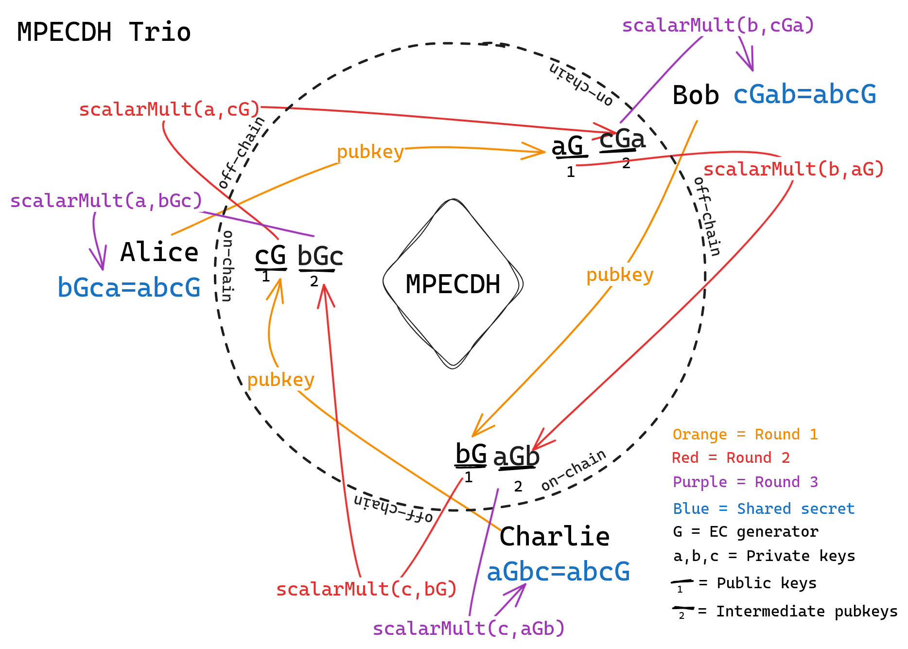

# MPECDH

Multi-party [ECDH](https://en.wikipedia.org/wiki/Diffie%E2%80%93Hellman_key_exchange#Operation_with_more_than_two_parties
)

Facilitates deriving a shared secret among an arbitrarily sized set of peers. 

`MPECDH` is an abstract contract requiring a 

```sol
function _getSigners()
    internal
    view
    override
    returns (address[] memory _signers);
```

impl. There is a concrete [`SafeMPECDH`](./src/SafeMPECDH.sol) contract for use with Safes.

## Usage

1. Deploy a `SafeMPECDH` instance via Safe (`proposeMPECDHDeployment`)

2. Run the bootstrap ceremony with all signers (`step0` & `stepN`)

3. Then each signer can derive the shared secret separately (`stepX`)

```js
const { calcMPECDHAddress, getOwners, isMPECDHDeployed, isMPECDHReady, proposeMPECDHDeployment, mpecdh } = require("./src/index")

// in your dapp you will only have one ethers signer available at a time but 
// using three here 4 demo and to make the relation between number of rounds 
// and signers clear
const signers = [alice, bob, charlie] = await ethers.getSigners()

const safeAddress = "some safe address"
// we use create2 thru Safe's CreateCall lib for deterministic addresses
const mpecdhAddress = calcMPECDHAddress(safeAddress, await getOwners(safeAddress))
const isDeployed = await isMPECDHDeployed(safeAddress)
const isReady = await isMPECDHReady(safeAddress, provider)
if (isDeployed && !isReady) {
// Safe's MPECDH instance already deployed at mpecdhAddress
// skip deployment and proceed with the mpecdh(mpecdhAddress, provider) ceremony
} else if (isDeployed && isReady) {
// Safe's MPECDH instance already deployed and set up at mpecdhAddress
// skip deployment and the mpecdh(mpecdhAddress, provider) ceremony
// each signer can derive the shared secret via choreo.stepX
}

// propose deployment of a SafeMPECDH instance at mpecdhAddress
await proposeMPECDHDeployment(signer, safeAddress)

// ...once enough signers have confirmed the tx and it got executed you should
// run the MPECDH bootstrap ceremony...

// each signer instantiates a ceremony helper
const choreo = await mpecdh(mpecdhAddress, alice.provider)

// run the bootstrap ceremony:
// each signer needs to call `step0` initially
// then each signer needs to call `stepN` for `signers.length - 2` rounds:
// each signer must submit their current-round contribution before any other 
// signer can proceed to submitting their next-round contribution
for (const signer of signers) {
    await choreo.step0(signer)
}
for (let i = 0; i < signers.length - 2; i++) {
    for (const signer of signers) {
        await choreo.stepN(signer)
    }
}
// encountering errors means that the previous round has not been completed, 
// i.e. some signer still needs to submit their contribution for that round,
// in such case call `await choreo.blocking()` to list all pending signers

// finally each signer can independently derive the shared secret
for (const signer of signers) {
    signer.sharedSecret = await choreo.stepX(signer)
}
```


